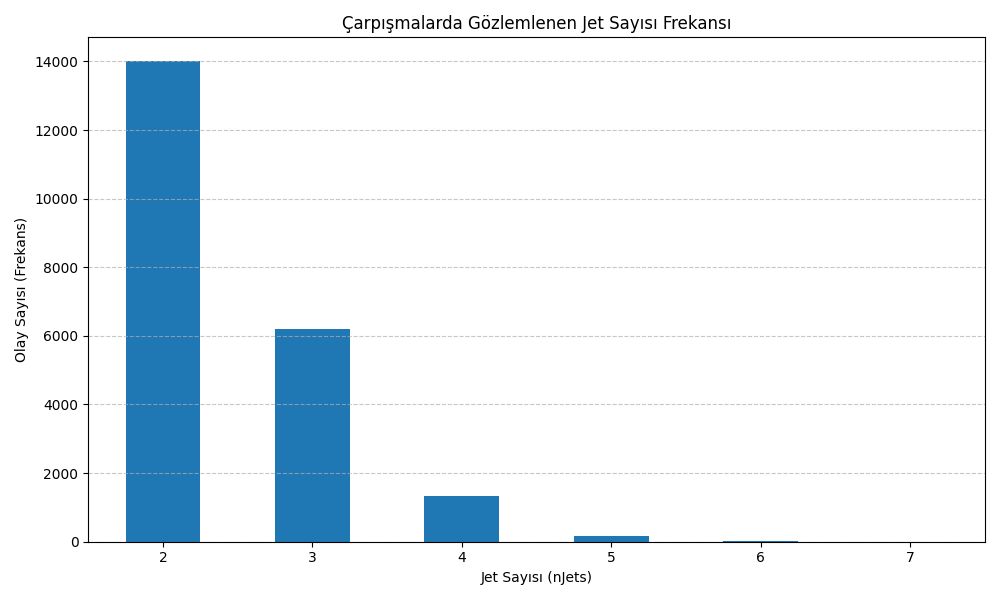

# CERN Jet Frequency Analysis

This project analyzes real collision data from the CMS experiment at CERN to determine the frequency of jet counts observed in proton-proton collisions.

## 📂 Dataset
- Source: CERN Open Data Portal
- File used: MultiJetRun2010B.csv
- Column of interest: `nJets` (number of jets observed per collision event)

## 🎯 Objective
To visualize how many jets are typically observed in collision events, and identify the most common jet counts.

## 📈 Sample Output
The following bar chart shows the frequency distribution of jet counts:

## 🛠 Technologies
- Python
- Pandas
- Matplotlib

## ✨ Outcome
This simple analysis reveals that most events involve 2 jets, with frequency decreasing as jet count increases.

## 🔬 Author
Hatice Zeynep Karakoç – Mathematical Engineering Student
